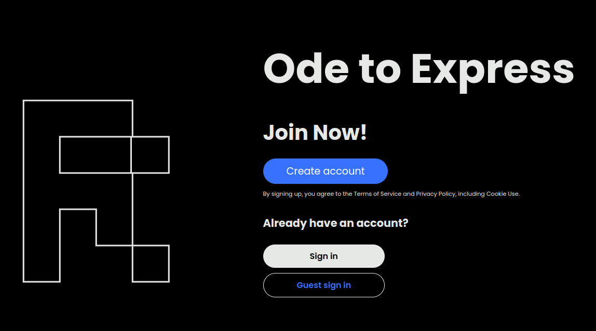
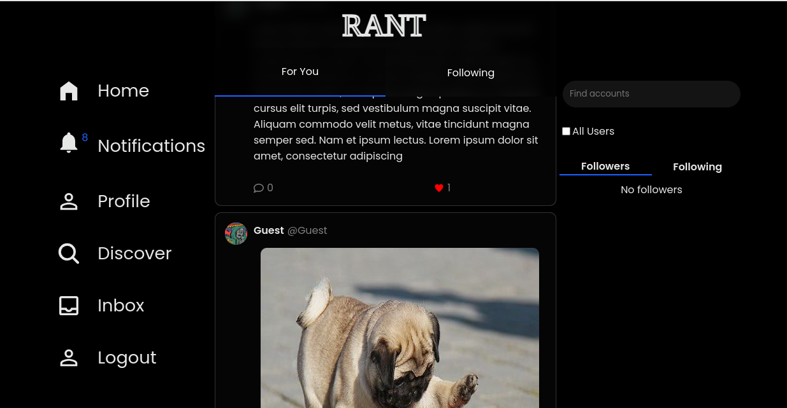

# PERN Social Media App | FRONTEND

RANT is a social media app, that uses sockets and REST API architecture,to allow users to make posts and send messages.

### Social Media App | Backend

[https://github.com/Lspacedev/social-media-app-backend](https://github.com/Lspacedev/social-media-app-backend)

## Installation

1. Clone the repository

```bash
git@github.com:Lspacedev/social-media-app-frontend.git
```

2. Navigate to the project folder

```bash
cd social-media-app-frontend
```

3.  Install All Dependencies

```bash
npm install
```

4. Create an env file and add the following:

```bash
VITE_PROD_URL="Deployed backend url or localhost"
```

5. Run the project

```bash
npm run dev
```

## Screenshot




## Features

Users

- Authentication: Create a user account.
- Authentication: Login to your account.
- View profile.
- Update profile i.e username, profile picture, profile header.
- View user's posts.
- View user's likes
- View user's followers and following
- View other user's profiles.
- Follow or unfollow users.

- Search users.
- Search all posts.

- Create posts
- View feed posts.
- View following posts.
- Like posts.
- Comment on posts.

- Recieve and delete notifications.
- Send and recieve messages from and to other users.

## Usage

1. Open the live site in your browser.
2. Login or create an account.
3. View posts, manage profile, send messages.

## Tech Stack

- ReactJs
- NodeJs
- ExpressJs
- PostgreSQL
- Supabase storage
- Socket.io

## Credits:

```python
Image by <a href="https://pixabay.com/users/wanderercreative-855399/?utm_source=link-attribution&utm_medium=referral&utm_campaign=image&utm_content=973460">Stephanie Edwards</a> from <a href="https://pixabay.com//?utm_source=link-attribution&utm_medium=referral&utm_campaign=image&utm_content=973460">Pixabay</a>

```
